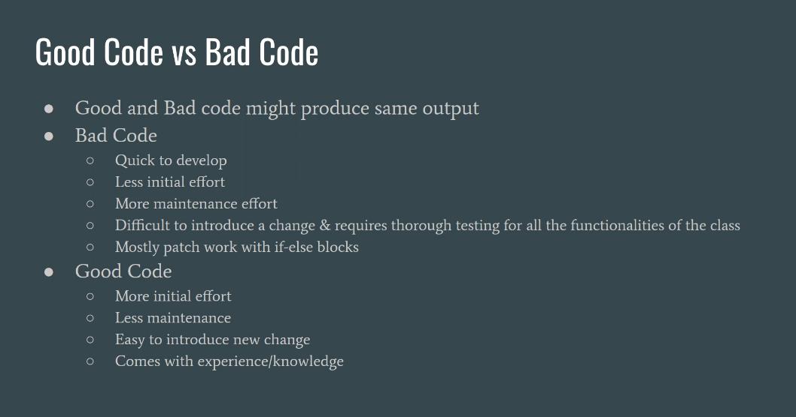
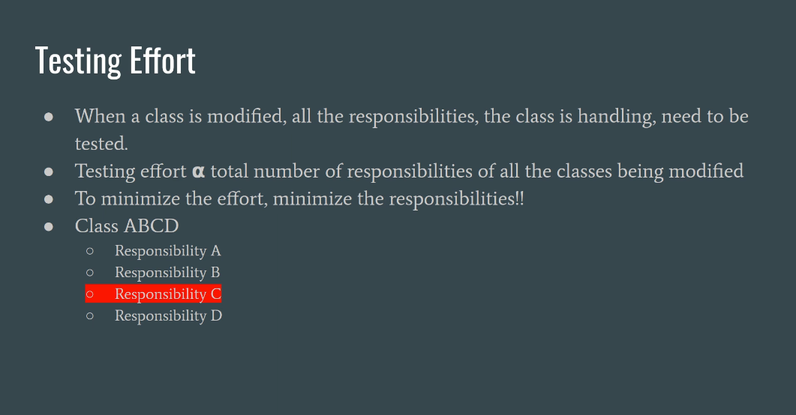
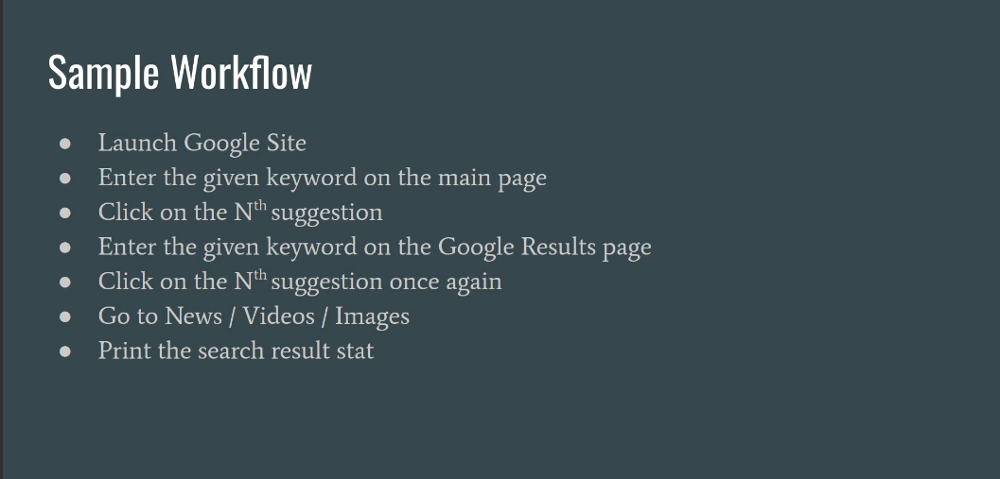
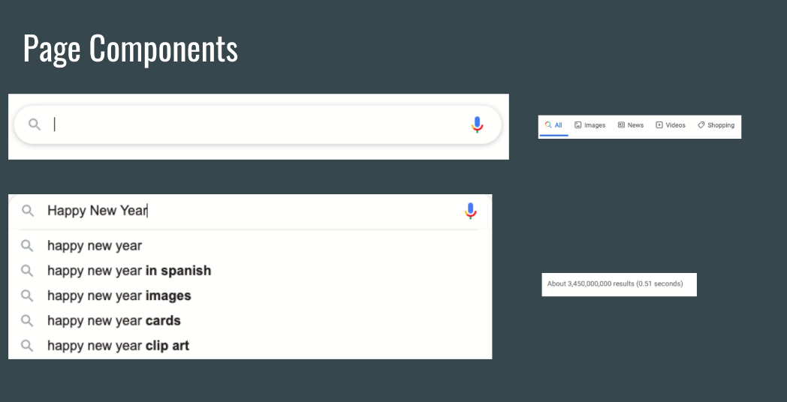
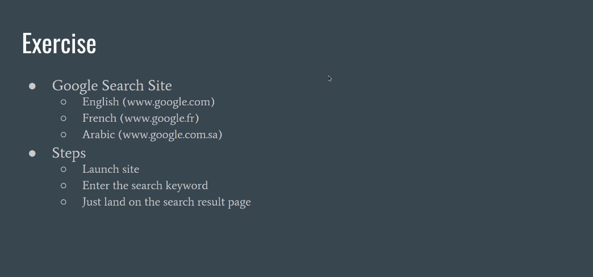

# Cleanium

This project showcases the clean coding best practices and design patterns for test automation using Java and Selenium
WebDriver

* This branch `vins/sdet-design-patterns` contains the coding snippets and notes taken from
  the
  course [Design Patterns For SDET With Selenium](https://www.udemy.com/course/selenium-webdriver-and-design-patterns)
  by [Vinoth Selvaraj](https://www.vinsguru.com/vinoth-selvaraj/)





* We can classify design patterns into 3 categories as shown below.
* Creational Pattern (Object creation mechanism)
  * Factory
* Behavioral Pattern (Object with algorithms/ behavior)
  * Strategy
  * Temmplate method
  * Command
  * Execute Around
* Structural Pattern (how to assemble objects and classes into larger structures)
  * Decorator
  * Proxy

## Single Responsibility Principle (SRP)

* A class should have only one responsibility / one reason to change
* Highly Cohesive
    * Cohesion is the measure of the degree of the relationship of the members within the class.
    * High cohesion -> all the members of class are very closely related
    * Low cohesion -> members are not related
* Loosely Coupled
    * Coupling is the measure of the degree of dependencies among classes/ modules.
    * Highly coupled -> Too many dependencies (a class/ module cannot work without one another)
    * Loosely coupled -> Less dependencies
* Always keep your classes small. Remember KISS principle (keep it simple stupid)
* All design patterns are implementation of SRP interface.



* Composition over Inheritance
    * Instead of putting all the reusable elements inside BasePage and extend child page classes with inheritance,
      rather create separate page components for each section of the page and connect them.
        * We identified following components for the pages so we will create separate classes for each of them.



* We want all the components to have a functionality to be able to check if the component is displayed. so we will only
  interact with component if it is displayed. For this purpose, we create an abstract class for component.
* Use Wait with lambda expression to define a custom wait condition that waits until number of search suggestions are
  more than 5.
    * wait.until() accepts a Function lambda which accepts webdriver as input, and returns boolean as output.

```java
@Override
public boolean isDisplayed(){
  return this.wait.until((d)->this.suggestions.size()>5);
  }

```

* Using `PageFactory.initElements(driver, this);` in the parent class allows us to instantiate all the child page
  classes, so therefore we put it inside Abstract component.
* Similarly, we can implement the isDisplyed() for SearchWidget using java 8 features.

```java
@Override
public boolean isDisplayed(){
  //conventinal approach
  //this.wait.until(ExpectedConditions.visibilityOf(this.searchbox));
  //return this.searchbox.isDisplayed();

  //java 8 way  
  return this.wait.until((d)->this.searchbox.isDisplayed());
  }

```

* Instead of entering the text all at once in search widget, we type one character at a time because Google sends a
  unique Ajax request to load different search suggestions for every character we enter in the search widget.
* `sendkeys()` accept a string so we append an empty space at the end to make it a string.
* we refactored the project structure to different packages for page classes and components. Each package contains a
  single page class and multiple components. All the shared components are placed inside a common package.
* All our components are highly cohesive. This means that all the elements are related to each other for example,
  navigation component has members only related to navigation bar and it does not contain any information about search
  widget or suggestions widget.
* Any change will only happen in the corresponding widget class so this also adheres to loosely coupled principle.


## Factory Pattern

* create a new object without exposing an instantiation logic
* refer to the newly created object using its common interface
* For example, we refer to the chrome driver, firefox driver etc. through webdriver interface



* 


## Resources

* [Gangs of Four (GoF) Design Patterns](https://www.digitalocean.com/community/tutorials/gangs-of-four-gof-design-patterns)
* [Design Patterns: Elements of Reusable Object-Oriented Software](https://www.oreilly.com/library/view/design-patterns-elements/0201633612/)