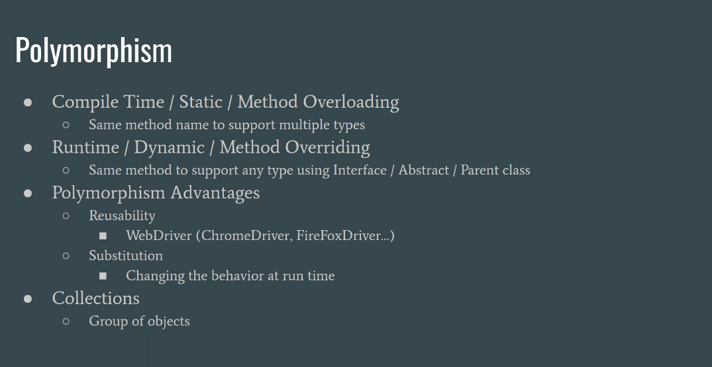

# Cleanium

This project showcases the clean coding best practices and design patterns for test automation using Java and Selenium
WebDriver

* This branch `vins/java8-and-beyond` contains the coding snippets and notes taken from
  the
  course [Java Lambda & Streams -Examples With Selenium WebDriver](https://www.udemy.com/course/java-8-and-beyond-for-testers)
  by [Vinoth Selvaraj](https://www.vinsguru.com/vinoth-selvaraj/)

---

## Basics

* java is always `pass by value`
* Functional style programming encourages immutable objects

### Polymorphism

* ability to present an interface for different types of data
* Compile time/ static/ Method overloading
    * It helps to define methods of same name with different return types/ parameters
    * See `AreaCalulator` example
* Run time/ dynamic/ Method Overriding
    * Create abstract class/ interface and place all common behaviors in it
    * You can create an instance of different implementations and refer them via interface/abstract class for usability
    * See `AnimalDemo` and `AlarmDemo` example
    *

### Collections

* To store group of similar objects
* To provide operations such as search, insert, delete etc.
    * List
    * Set
    * Queue
    * Stack
* Array size is fixed so we need a collection to store dynamic length objects
* You can create a list of abstract class or interface e.g. Animal and collect all the animals in a `List<Animal>`
* You cannot use list to collect primitive types, rather you need to use Wrapper classes to collect them in a
  list e.g. `List<Integer>`
* Java internally does the `boxing` for us i.e. convert primitive types to reference types

