# Cleanium

This project showcases the clean coding best practices and design patterns for test automation using Java and Selenium
WebDriver

* This branch `vins/java8-and-beyond` contains the coding snippets and notes taken from
  the
  course [Java Lambda & Streams -Examples With Selenium WebDriver](https://www.udemy.com/course/java-8-and-beyond-for-testers)
  by [Vinoth Selvaraj](https://www.vinsguru.com/vinoth-selvaraj/)

---

## Basics

* java is always `pass by value`
* Functional style programming encourages immutable objects

### Polymorphism

* ability to present an interface for different types of data
* Compile time/ static/ Method overloading
    * It helps to define methods of same name with different return types/ parameters
    * See `AreaCalulator` example
* Run time/ dynamic/ Method Overriding
    * Create abstract class/ interface and place all common behaviors in it
    * You can create an instance of different implementations and refer them via interface/abstract class for usability
    * See `AnimalDemo` and `AlarmDemo` example

> Interfaces define contract. Abstract classes provide default functionality for sub classes. (Java8 has added similar
> feature to interfaces as
> well)

* Car can be an interface.
* Honda can be an abstract class which implements the Car
    * Civic and Accord are some implementations which extend Honda abstract class.
* Toyota can be an another abstract class which implements the Car
    * Camry can extend Toyota abstract class
* Interfaces are for '`HAS-A`' relationship.
* Abstract classes for '`IS-A`' relationship.

### Collections

* To store group of similar objects
* To provide operations such as search, insert, delete etc.
    * List
    * Set
    * Queue
    * Stack
* Array size is fixed so we need a collection to store dynamic length objects
* You can create a list of abstract class or interface e.g. Animal and collect all the animals in a `List<Animal>`
* You cannot use list to collect primitive types, rather you need to use Wrapper classes to collect them in a
  list e.g. `List<Integer>`
* Java internally does the `boxing` for us i.e. convert primitive types to reference types

## Lambda

* Lambda expression is basically an implementation of interface. Interface must contain only one abstract method to act
  as functional interface.
* SAM (Single Abstract Method) -> `@FunctionalInterface` annotation makes the interface to have only one abstract method
  to act as lambda.
* Functional programming is a way of building software by using pure functions and by avoiding state sharing and
  side-effects.
    * shared state: a variable being shared by more than 1 function
    * side effect: function modifies the variable
* Pure function
    * function output should stay consistent for the given input for all the threads
* Function as first-class object
    * ability to assign function to a variable - having a reference of a function
* Higher-order function
    * A method which receives another function as a parameter is a higher order function
* Method References
    * Single line lambda expression which call existing methods that can be rewritten using method references
    * If you are going to pass the data to another method, then you can rewrite it simply as method reference
    * compact and easy to read

## Functional Interfaces

* Chaining only works with similar types.
* chaining of consumer means all the consumers get same reference, while in function chaining, the subsequent function
  gets the output of first functions as input.

* Supplier and Callable are almost same
* Runnable does not accept and return anything

## Stream API

* All the elements in collect go through the stream line one by one. Each element goes through the whole stream pipeline
  first, and then next element goes and so-on.

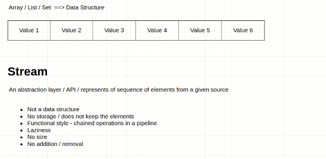

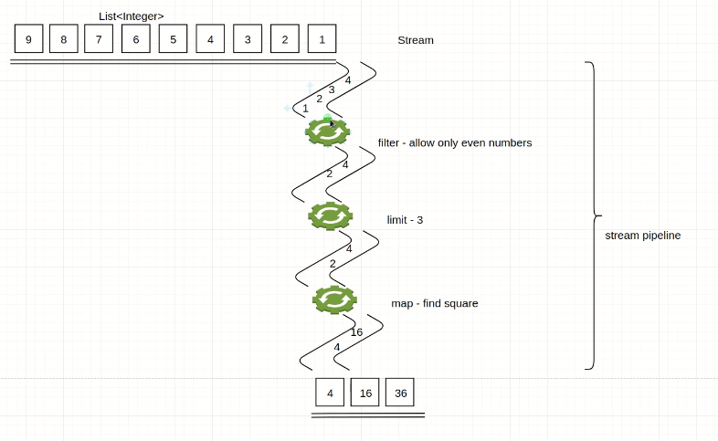

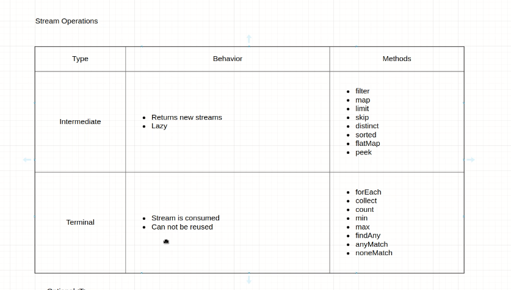

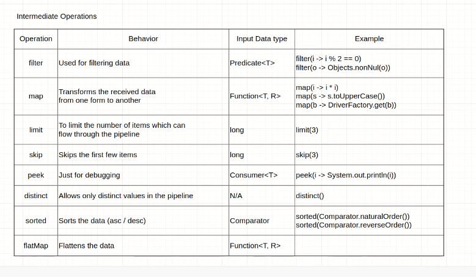

* `sorted()` works differently. In order to sort the elements, it needs to know all the elements upfront.
    * After it has sorted the elements, then it will let the elements flow through the pipeline.
* stream does not throw null pointer exception in case of empty list. It only works if there is a non empty collection.
* Checkbox Selection assignment
    * https://vins-udemy.s3.amazonaws.com/java/html/java8-stream-table.html
    * select checkboxes based on gender

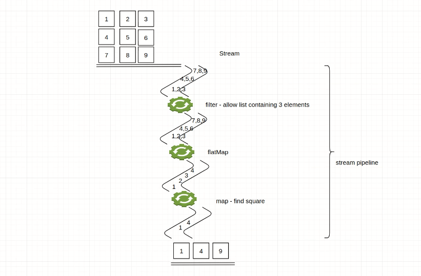

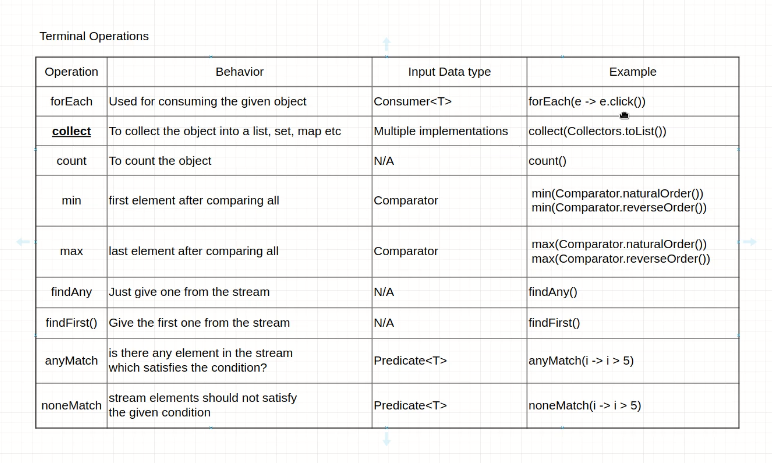

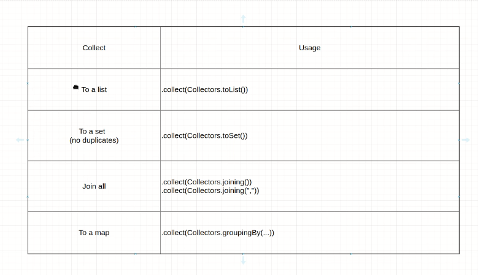

* [Differences of Java 16's Stream.toList() and Stream.collect(Collectors.toList())?](https://stackoverflow.com/questions/65969919/differences-of-java-16s-stream-tolist-and-stream-collectcollectors-tolist)

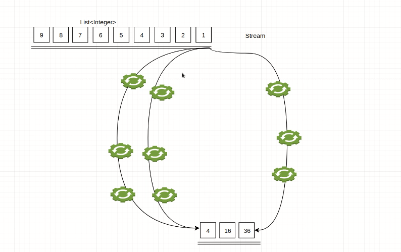

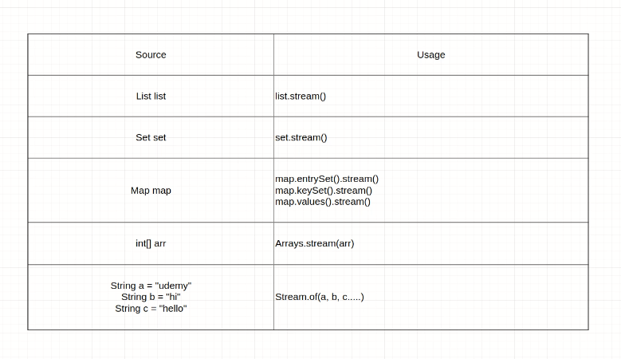

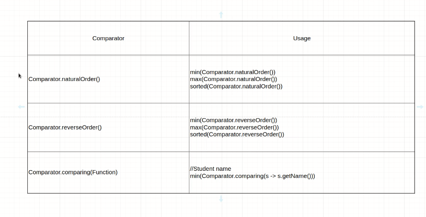

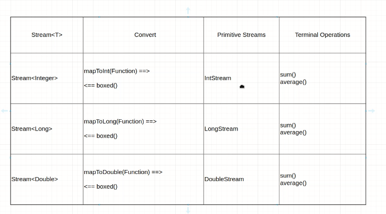

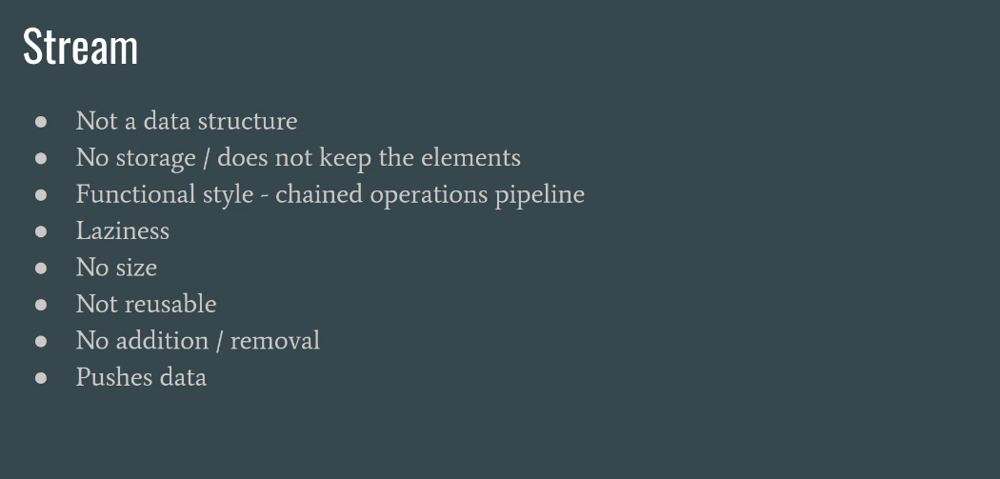

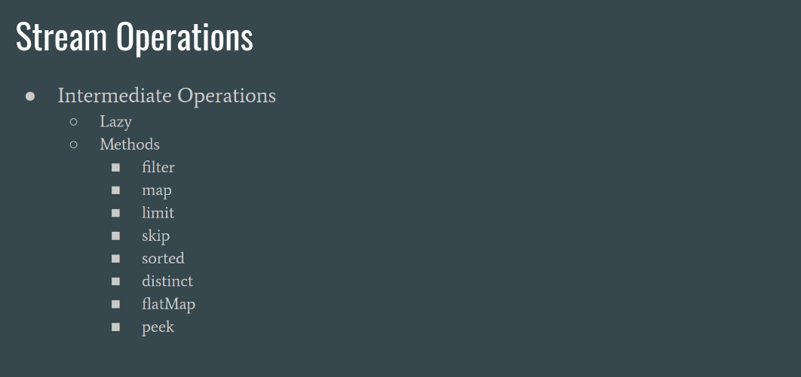

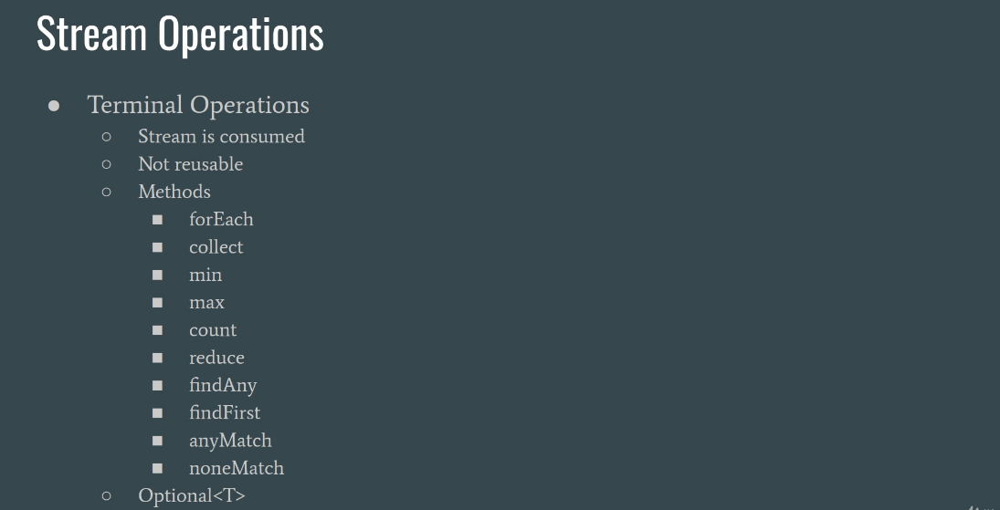

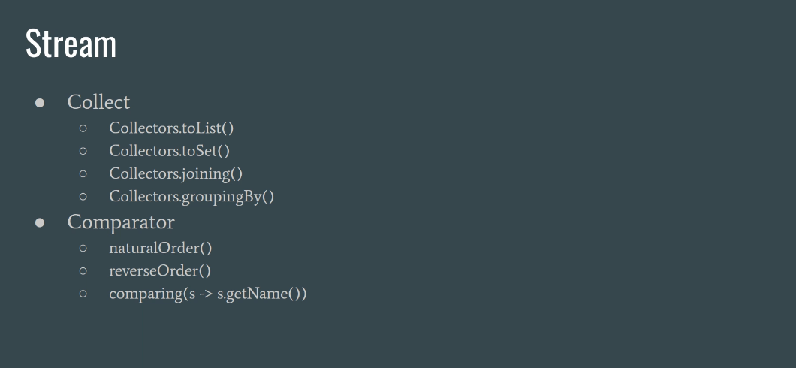

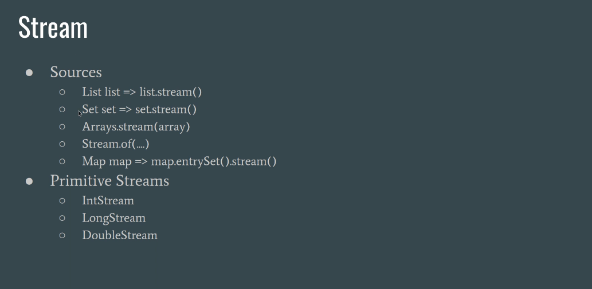

