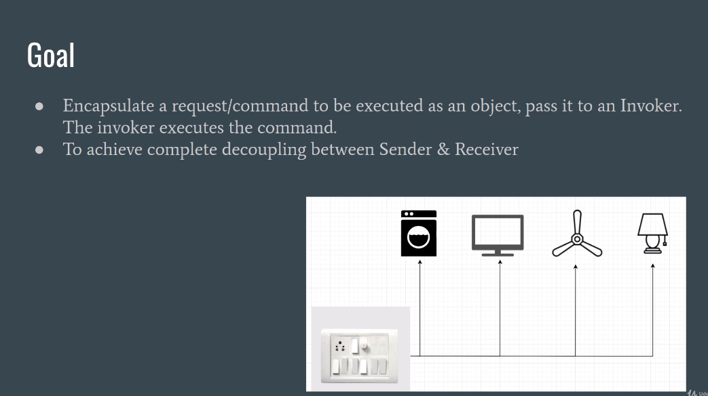

# Cleanium

This project showcases the clean coding best practices and design patterns for test automation using Java and Selenium
WebDriver

* This branch `vins/sdet-design-patterns` contains the coding snippets and notes taken from
  the
  course [Design Patterns For SDET With Selenium](https://www.udemy.com/course/selenium-webdriver-and-design-patterns)
  by [Vinoth Selvaraj](https://www.vinsguru.com/vinoth-selvaraj/)


* We can classify design patterns into 3 categories as shown below.
* Creational Pattern (Object creation mechanism)
    * Factory
* Behavioral Pattern (Object with algorithms/ behavior)
    * Strategy
    * Temmplate method
    * Command
    * Execute Around
* Structural Pattern (how to assemble objects and classes into larger structures)
    * Decorator
    * Proxy

## Single Responsibility Principle (SRP)

* A class should have only one responsibility / one reason to change
* Highly Cohesive
    * Cohesion is the measure of the degree of the relationship of the members within the class.
    * High cohesion -> all the members of class are very closely related
    * Low cohesion -> members are not related
* Loosely Coupled
    * Coupling is the measure of the degree of dependencies among classes/ modules.
    * Highly coupled -> Too many dependencies (a class/ module cannot work without one another)
    * Loosely coupled -> Less dependencies
* Always keep your classes small. Remember KISS principle (keep it simple stupid)
* All design patterns are implementation of SRP interface.


* Composition over Inheritance
    * Instead of putting all the reusable elements inside BasePage and extend child page classes with inheritance,
      rather create separate page components for each section of the page and connect them.
        * We identified following components for the pages so we will create separate classes for each of them.


* We want all the components to have a functionality to be able to check if the component is displayed. so we will only
  interact with component if it is displayed. For this purpose, we create an abstract class for component.
* Use Wait with lambda expression to define a custom wait condition that waits until number of search suggestions are
  more than 5.
    * wait.until() accepts a Function lambda which accepts webdriver as input, and returns boolean as output.

```java
@Override
public boolean isDisplayed(){
  return this.wait.until((d)->this.suggestions.size()>5);
  }

```

* Using `PageFactory.initElements(driver, this);` in the parent class allows us to instantiate all the child page
  classes, so therefore we put it inside Abstract component.
* Similarly, we can implement the isDisplyed() for SearchWidget using java 8 features.

```java
@Override
public boolean isDisplayed(){
  //conventinal approach
  //this.wait.until(ExpectedConditions.visibilityOf(this.searchbox));
  //return this.searchbox.isDisplayed();

  //java 8 way  
  return this.wait.until((d)->this.searchbox.isDisplayed());
  }

```

* Instead of entering the text all at once in search widget, we type one character at a time because Google sends a
  unique Ajax request to load different search suggestions for every character we enter in the search widget.
* `sendkeys()` accept a string so we append an empty space at the end to make it a string.
* we refactored the project structure to different packages for page classes and components. Each package contains a
  single page class and multiple components. All the shared components are placed inside a common package.
* All our components are highly cohesive. This means that all the elements are related to each other for example,
  navigation component has members only related to navigation bar and it does not contain any information about search
  widget or suggestions widget.
* Any change will only happen in the corresponding widget class so this also adheres to loosely coupled principle.

## Factory Pattern

* The factory pattern takes out the responsibility of instantiating a object from the class to a Factory class.
* create a new object without exposing an instantiation logic
* refer to the newly created object using its common interface
* For example, we refer to the chrome driver, firefox driver etc. through webdriver interface


* In the above example, we are using factory pattern to create different page classes based on supplied language.
* Refined the instructor's solution more to incorporate alerts for cookies and added an AbstractPage
* [WebDriver Management using Factory Pattern](https://www.vinsguru.com/selenium-webdriver-design-patterns-in-test-automation-factory-pattern/)
* [Factory Pattern using Java 8 Supplier](https://www.vinsguru.com/selenium-webdriver-factory-design-pattern-using-java-8-supplier/)


## Strategy Pattern

* Define a family of algorithms/ behaviors, encapsulate each one, and make them interchangeable
* Strategy pattern is used when we have multiple algorithm for a specific task and client decides the actual
  implementation to be used at runtime.
* For example, a BluRay player can perform different actions depending upon the type of CD
    * DVD
    * BluRay
* [Google Text / Voice search using Strategy pattern](https://www.vinsguru.com/selenium-webdriver-design-patterns-in-test-automation-strategy-pattern/)
* Exercise: Write a test to submit the order with different payment strategies
    * https://vins-udemy.s3.amazonaws.com/ds/strategy.html

* In conventional approach, we place a lot of if-else blocks to achieve the desired behavior based on payment option


* Factory patterns allows us to create an interface and choose the behavior at run time.


* we are changing the behavior of payment screen at run time by providing different implementations of `IPayemntOption`.
  In our tests we are using this interface so our tests and payment screen is not tied to specific payment method.
* Initial solution shows how to achieve this using abstract class instead of interface.
* Exercise 02:
    * https://fly4.emirates.com/CAB/IBE/SearchAvailability.aspx


## Command Pattern

* Command Pattern is used to implement lose coupling in a request-response model.



* Consider this site, where we have to validate the notification toast, and dismissal alert.
    * https://vins-udemy.s3.amazonaws.com/ds/admin-template/admin-template.html
* Conventional approach would like like this: we repeat the same steps in sequence


* To apply the command pattern, we create a validator that encapsulates the logic of validating these components.
* Test classes will invoke these validators to perform the validation and assertions.

## Template Method Pattern

* Template method is a special case of factory pattern.
* used to create a template method stub and defer some of the steps of implementation to the subclasses.


* We create a shopping template for two websites i.e. OpenCart and Ebay.
    * Both the sites follow a common sequence of steps to perform a buying process. Search product, select product, open
      details page, and place order.
    * For demo purposes, we automate till landing on the details page.
* Both the Amazon and Ebay templates implement the abstract shopping template.
* In template pattern, we can also include multiple screens in template class. For example, we added different screens
  to the OpenCartShopping template and delegated the calls to page objects.

## Proxy pattern

* Provide a surrogate or placeholder for another object to control access to it.
* Provides a placeholder object instead of actual object and restricted access. Example, office Internet
* Example, if you are running tests on multiple environments, then your test scripts contain many conditional statemenst
  to execute or not certain steps based on how much previliges you have in certain environment.


* Imagine we want to execute automated tests on this site: https://vins-udemy.s3.amazonaws.com/ds/strategy.html
* we will not place order on production environment, so we apply proxy design pattern which allow us to achieve results
  without conditionals in code.
* We use the same code snippets for starter as used in the strategy pattern because the site is same.
* We create an interface for OrderComponent that has abstract method for placing order which return order ID. Then we
  create two classes to implement this order component interface, i.e. real and proxy.
* Proxy component will check if the current environment belongs to excluded environments. If it is a higher environment
  like stage or production, then we skip the buying order and return a static message. Else if it is lower environment,
  we call the buying from real component.
* In our page objects, we are generating a new instance of proxy component.
* We do not have to change our test class from the strategy pattern except only adding the env system property. Proxy
  component will handle the buying operation for us based on this environment.


## Execute Around Method Pattern

* Typically used when we have to perform certain steps before and after performing any action.


* Demo Website: https://vins-udemy.s3.amazonaws.com/ds/main.html
    * We have to switch to the frame before performing element actions, and after we have to switch back to default
      content.
    * Traditional approach would look like this:

    ```java
      public FrameA getFrameA(){
        this.driver.switchTo().defaultContent();
        this.driver.switchTo().frame(a);
        return frameA;
      }
    
    @Test
    public void frameTest(){
      this.mainPage.getFrameA().setFirstName("abc");
    }
    ```
* Above approach will not work if we want to store the frame inside variable and perform actions on different frames.
* We can make use of functional style programming with Consumers and pass behavior or action to the method itself.
* Inside the methods, we can do some logging, and switching to frame.

```java
      public void onFrameA(Consumer<FrameA> consumer){
  this.driver.switchTo().frame(a);
  consumer.accept(this.frameA);
  this.driver.switchTo().defaultContent();
  }

@Test
public void frameTest(){
  this.mainPage.goTo();
  this.mainPage.onFrameA(a->{
  a.setFirstName("fn1");
  a.setMessage("I am going to fill text area");
  });
  this.mainPage.onFrameC(c->c.setAddress("address for FrameC"));
  this.mainPage.onFrameB(b->b.setMessage("this is for Frame B"));
  }
```

* This allows us to be flexible and pass the behavior directly to the method without fetching the frame first.
*

## Resources

* [Gangs of Four (GoF) Design Patterns](https://www.digitalocean.com/community/tutorials/gangs-of-four-gof-design-patterns)
* [Design Patterns: Elements of Reusable Object-Oriented Software](https://www.oreilly.com/library/view/design-patterns-elements/0201633612/)
* [Selenium WebDriver – Factory Design Pattern Using Java 8 – Supplier](https://www.vinsguru.com/selenium-webdriver-factory-design-pattern-using-java-8-supplier/)
* [Selenium WebDriver – Design Patterns in Test Automation – Factory Pattern](https://www.vinsguru.com/selenium-webdriver-design-patterns-in-test-automation-factory-pattern/)
* [Selenium WebDriver – Design Patterns in Test Automation – Strategy Pattern](https://www.vinsguru.com/selenium-webdriver-design-patterns-in-test-automation-strategy-pattern/)
* [Selenium WebDriver – Design Patterns in Test Automation – Template Method Pattern](https://www.vinsguru.com/selenium-webdriver-design-patterns-in-test-automation-template-method-pattern/)
* [Selenium WebDriver – Design Patterns in Test Automation – Proxy Pattern](https://www.vinsguru.com/selenium-webdriver-design-patterns-in-test-automation-proxy-pattern/)
* [Selenium WebDriver – Design Patterns in Test Automation – Decorator Design Pattern](https://www.vinsguru.com/selenium-webdriver-design-patterns-in-test-automation-decorator-design-pattern/)
* [Selenium WebDriver – Design Patterns in Test Automation – Chain Of Responsibility Design Pattern](https://www.vinsguru.com/selenium-webdriver-design-patterns-in-test-automation-chain-of-responsibility-design-pattern/)
* [Selenium WebDriver – Design Patterns in Test Automation – Execute Around Method Pattern](https://www.vinsguru.com/selenium-webdriver-execute-around/)

### Tips and Tricks

* [Selenium WebDriver – How To Design Business Workflows In Fluent Style](https://www.vinsguru.com/selenium-webdriver-how-to-design-test-business-workflows-in-fluent-style/)
* [Selenium WebDriver – How To Design Tests & Test Data](https://www.vinsguru.com/selenium-webdriver-how-to-design-tests-test-data/)
* [Selenium WebDriver – How To Handle Page Synchronization Using Awaitility](https://www.testautomationguru.com/selenium-webdriver-how-to-wait-for-expected-conditions-using-awaitility/)
* [Selenium WebDriver – How To Improve Test Performance Using Java8 Stream](https://www.vinsguru.com/selenium-webdriver-improving-test-performance-using-java8-stream/)
* [Selenium WebDriver – How To Handle Annoying Random Popup / Alerts](https://www.vinsguru.com/selenium-webdriver-how-to-handle-annoying-random-popup-alerts/)
* [Selenium WebDriver – How To Automatically Switch Among Browser Windows](https://www.vinsguru.com/selenium-webdriver-automatic-switching-between-browser-windows-using-guice-method-interceptor/)
* 